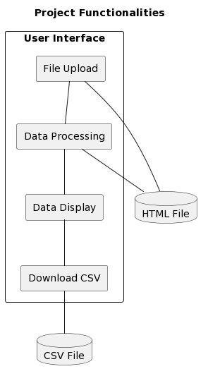

# HTML Table Extractor (Work Purposes - Internal Tool)

This is a web application built with [Streamlit](https://streamlit.io) that allows users to upload an HTML file, extracts table data from the HTML, and provides a download link for the extracted data in CSV format.



## Features

- File uploader that accepts HTML files
- Displays the extracted table data as a pandas DataFrame
- Provides a download link for the extracted data in CSV format

## Usage

To use this application, follow these steps:

1. Visit the deployed application URL. (You should provide the URL where the application is deployed here)
2. Use the file uploader to upload an HTML file.
3. Once the file is uploaded, the application will automatically parse the HTML file and display the extracted data.
4. Click on the "Download CSV file" link to download the extracted data in CSV format.

## Development

This application is built with Python, using the Streamlit library for the web interface, BeautifulSoup for parsing the HTML, and pandas for handling the data. It's deployed on [Streamlit Sharing](https://streamlit.io/sharing).

If you want to run the application locally, you'll need to have Python installed, along with the packages specified in `requirements.txt`. You can install these packages with pip:

```
pip install -r requirements.txt
```

After installing the dependencies, you can run the application with Streamlit:

```
streamlit run app.py
```

## Contributions

Contributions to this project are welcome! If you find a bug or think of a new feature, feel free to open an issue or a pull request. :)
